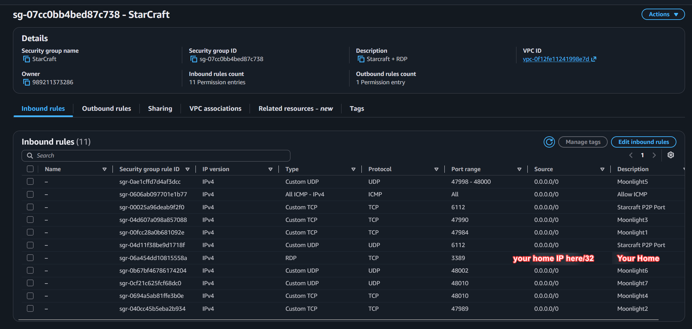

This is for advanced tech savvy people or people who are comfortable using AI to help them set this all up.

This is the way I've been playing on the KR servers without having to pay for GeForce Now.
- Storage costs about $4/mo at 50GB. This is the minimum amount you pay when the machine is off
- The actual machine when you turn it on, g4dn.xlarge, costs $0.526 per hour
- The servers are actually in Seoul not Tokyo
- And you can port forward to host games

This is not a full guide. It's just the framework of how it is all set up. Use AI to help you set it all up.

Anyways the point is this set up creates a KR computer in the Seoul Region. You will use a software combination called Moonlight and Sunshine.
To stream video from that machine to your machine. It will be like you're remote controlling the machine in KR.

Since Starcraft is P2P the Koreans won't experience lag from your KR virtual machine.

Below is a WIP Rough draft.

# Things to Do
- Create security groups for Starcraft and Moonlight Streaming Ports
- Make sure you're on Seoul Region in AWS
- Launch EC2 instance with Windows Server and 50GB of storage.
- Install Nvidia GRID Drivers: https://docs.aws.amazon.com/AWSEC2/latest/UserGuide/nvidia-GRID-driver.html
- Install Battle.net + Starcraft
- Install Sunshine the Moonlight Server
- Install VB- Audio the Audio driver
- Install Monitor Profile Switcher
- Install ViGEmBus for Sunshine
- Install VDD.Control

# Security Groups
Create these first. Then attach them to the Launch EC2 instance page.

# To Enhance performance further
- Install Tailscale on both machines
    - Register both machines to tailscape
    - Use AWS KR EC2 tailscale IP to connect moonlight from Host PC
    - Tailscale improves delay significantly (USA to KR improved a lot for me)
- Turn off Windows Network Throttling: 
    - Open Registry Editor on the VM (regedit), 
    - navigate to HKEY_LOCAL_MACHINE\SOFTWARE\Microsoft\Windows NT\CurrentVersion\Multimedia\SystemProfile
        - set NetworkThrottlingIndex to ffffffff (hexadecimal)
        - set SystemResponsiveness to 0. 
        - This prevents Windows from throttling network packet pacing during high-throughput video streaming.

