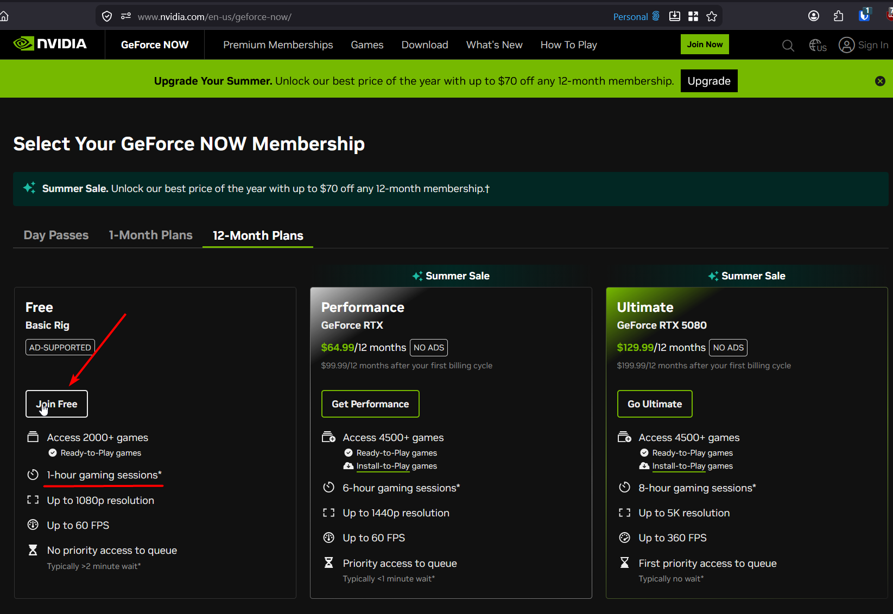
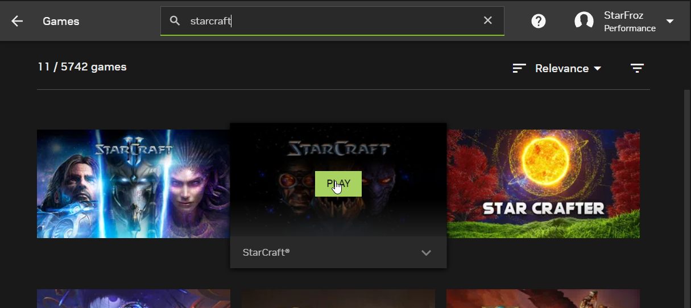
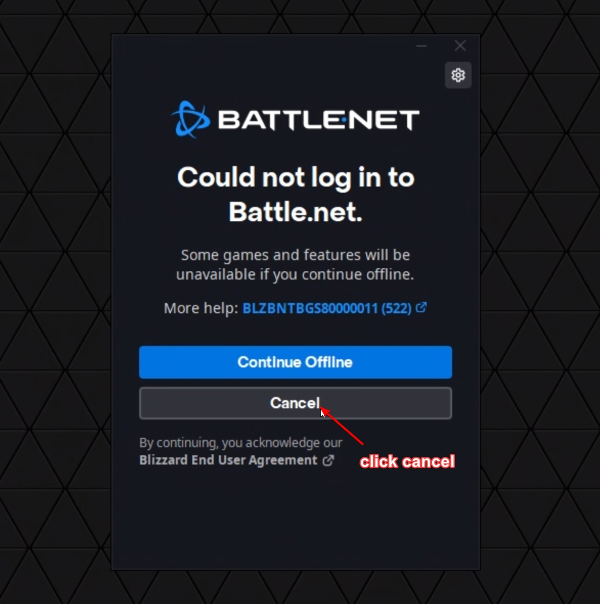
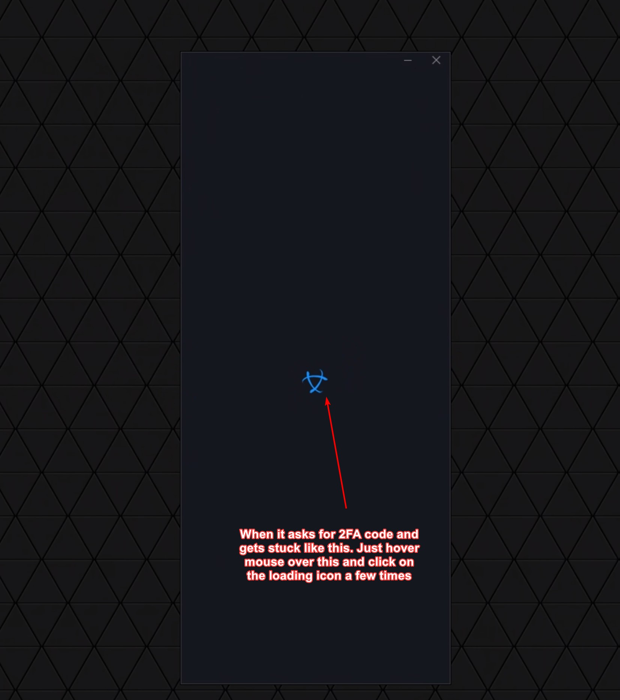
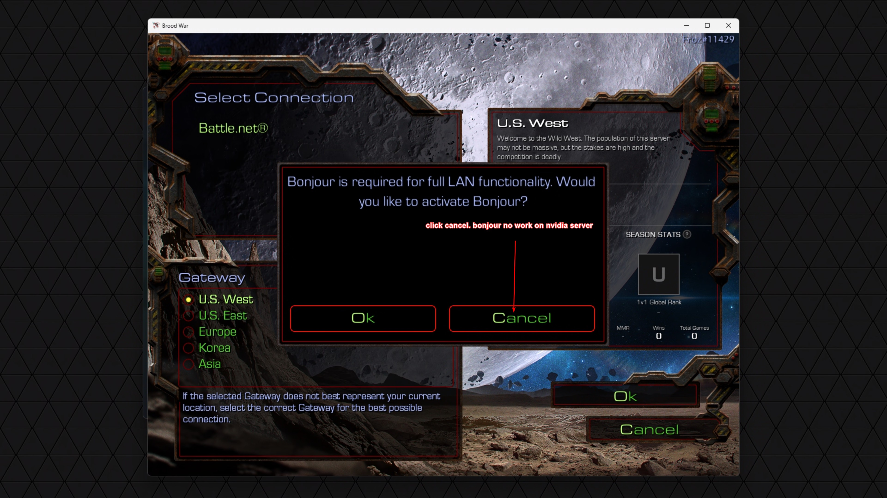

# Introduction
So you want to learn how to play on the KR server with 5 green latency bars from anywhere in the world?

There is a method to do this that is free to try before you commit tp paying.

You can skip the explanation below if you just want to play on KR without them complaining about you lagging everyone. Just skip to the **How to Play on KR Without Lag from Anywhere** section and see for yourself, it's very easy not complicated.

# Explanation
Yes, it is already established that we are limited by the speed of light and how fast it can travel around the world.

The tech here is we limit the lag to just streaming lag, instead of starcraft lag which is a lot worst (feels like 1-5 frames per second at worst)

Streaming lag on the other hand is just like getting an added 200ms delay to your actions. However the game runs at full speed smoothly (much better than 1-5 frams per second... you're getting full FPS)

How do we achieve this?

From your computer connect and stream video from NVidia's gaming computers in Japan. 

Since the physical distance from Japan to Korea is short, the latency between Japan and Korea is less than 50ms (woo 5 green bars!)

You are basically remote controlling a machine that is close to Korea and since starcraft is P2P it's basically connecting players to your Nvidia's gaming computer in Japan.

## Pros
- Smooth FPS gaming experience, full game speed
- 5 Green Bars = you don't get kicked from lobbies

## Cons
- Can't host games (Port forwarding not available)
- Stream delay (it's like playing on extra extra high latency)
- Free plan limits you to 1 hour per sesion + ADs

# How to Play on KR Without Lag from Anywhere
Sign up for Nvidia Geforce Now with this url: https://www.nvidia.com/en-us/geforce-now/

Scroll down and click Join Free to register.

- After going thru the registeration process. Login and download the Geforce Now app: https://www.nvidia.com/en-us/geforce-now/download/
- Install the Geforce Now App.
- After installation launch the GeForce Now
- Click the 3 bars on the top left
- Go to `Settings -> Gameplay`
- Change the Server location to `Japan`

Video Example of Server Location Switch below

https://github.com/user-attachments/assets/9f53d89d-aa9a-4969-a46b-865b429be2ec

- Then under `Settings -> Connections` connect your Battle.net account
- Go back to Games by clicking top left and clicking on `Games`
- Search for `StarCraft` and click `Play`

You will get a you are currently offline prompt. Just click cancel and login

Then login with email and password ignore any you are offline prompts.

You might get in a stuck logo loop. Don't worry it's not stuck just click on it and wait.

After that step you are done, just launch starcraft from the battle.net launcher and play starcraft normally. 

When asked about bonjour click no.

You can choose KR server and try it out! Might help if you pick the same in game name if you play the Korean UMS map SRD (3 kingdom random defense).

# Conclusion
Keep in mind on free, the max play time is 1 hour. So log out and log back in once you're done with a map.

Words to know for SRD players who don't speak korean.

이지 - Easy Difficulty
보통 - Normal Difficulty
어려움 - Hard Difficulty
ㅎㅇ - Hi

This is also not the only method. I only wrote about it because it has free to try. You can use any other cloud gaming service with regions close to korea. This is the only one I write about because it's free to try.

If you know about one that has a server in Korea + has port forwarding for hosting StarCraft games + is cheap please let me know.